# 🤖 Gesture Controlled Virtual Mouse

<div align="center">


[](https://github.com/Arya182-ui/Gesture-Virtual-Mouse)
[](https://github.com/Arya182-ui/Gesture-Virtual-Mouse)
[](https://python.org)
[](https://github.com/Arya182-ui/Gesture-Virtual-Mouse/tree/main/Demo%20Media)

</div>

---

## 🌟 **Project Overview**

A **next-generation gesture-based control system** that revolutionizes human-computer interaction using cutting-edge **Computer Vision** and **AI technologies**. This intelligent system transforms your hand movements into precise computer commands, enabling **touchless control** of your entire desktop environment through natural gestures.

**🎯 Vision:** *"Making technology more intuitive and accessible through natural human gestures."*

### 🚀 **Why This Project Matters**

<details>
<summary><b>🔮 Future of Human-Computer Interaction</b></summary>

In an era where touchless technology is becoming essential, this project demonstrates:
- **Intuitive Control**: Natural hand gestures replace traditional input devices
- **Accessibility Enhancement**: Assistive technology for users with mobility limitations
- **Hygiene Benefits**: Touchless interaction reduces contamination risks
- **Futuristic Experience**: Sci-fi inspired interface control in real-world applications

</details>

<details>
<summary><b>🤖 AI & Computer Vision Innovation</b></summary>

- **Real-Time Processing**: Advanced computer vision algorithms for instant gesture recognition
- **Machine Learning Integration**: MediaPipe's pre-trained models for accurate hand detection
- **Adaptive Learning**: System learns and improves gesture recognition over time
- **Cross-Platform Intelligence**: Universal gesture mapping across different applications

</details>

## 🎯 **Advanced Gesture Recognition Features**

<div align="center">

[](https://github.com/Arya182-ui/Gesture-Virtual-Mouse)
[](https://github.com/Arya182-ui/Gesture-Virtual-Mouse)
[](https://github.com/Arya182-ui/Gesture-Virtual-Mouse)

</div>

### 🖐️ **Core Gesture Controls**

<details>
<summary><b>🖱️ Advanced Mouse Operations</b></summary>

| **Gesture** | **Action** | **Technology** | **Use Case** |
|-------------|------------|----------------|--------------|
| ☝️ **Index Finger Up** | Cursor Movement | Hand landmark tracking | Precise navigation |
| 👆 **Index + Middle Finger** | Left Click | Finger distance calculation | Primary selection |
| 🤏 **Pinch Gesture** | Right Click | Thumb-index proximity detection | Context menus |
| ✌️ **Peace Sign** | Double Click | Gesture duration analysis | Application launch |
| 🖐️ **Open Palm** | Drag & Drop | Multi-finger position tracking | File operations |
| 👊 **Closed Fist** | Scroll Mode | Hand shape recognition | Document navigation |

</details>

<details>
<summary><b>🎮 Interactive Application Control</b></summary>

- ✅ **Application Launcher**: Custom gesture mapping to launch any installed application
- ✅ **Volume Control**: Hand distance gestures for system audio adjustment
- ✅ **Brightness Control**: Vertical hand movements for screen brightness
- ✅ **Drawing Mode**: Air drawing with finger tip tracking for digital art
- ✅ **Presentation Mode**: Gesture-based slide navigation and laser pointer
- ✅ **Gaming Interface**: Custom gesture mapping for game controls

</details>

<details>
<summary><b>🤖 AI-Powered Smart Features</b></summary>

- ✅ **Adaptive Sensitivity**: AI learns user gesture patterns for personalized control
- ✅ **Noise Filtering**: Advanced algorithms eliminate accidental gestures
- ✅ **Multi-Hand Support**: Simultaneous tracking of both hands for complex operations
- ✅ **Gesture Calibration**: Auto-calibration for different hand sizes and positions
- ✅ **Context Awareness**: Different gesture sets for different applications
- ✅ **Real-Time Feedback**: Visual indicators showing gesture recognition status

</details>

<details>
<summary><b>💻 User Interface & Experience</b></summary>

- ✅ **Lightweight GUI**: Intuitive Tkinter/PyQt interface for easy configuration
- ✅ **Real-Time Visualization**: Live hand tracking display with landmark overlay
- ✅ **Gesture Mapping**: Visual gesture configuration and customization panel
- ✅ **Performance Monitoring**: FPS and accuracy metrics display
- ✅ **Profile Management**: Save and load different gesture profiles
- ✅ **Cross-Platform Support**: Compatible with Windows, macOS, and Linux

</details>

## 🧠 **Technology Stack & AI Architecture**

<div align="center">

| **Category** | **Technology** | **Purpose** | **AI/CV Role** |
|--------------|----------------|-------------|----------------|
| 🤖 **Computer Vision** | OpenCV 4.x | Video capture & processing | Real-time frame analysis |
| 🖐️ **Hand Tracking** | MediaPipe | Hand landmark detection | 21-point hand pose estimation |
| 🎮 **System Control** | PyAutoGUI | Mouse & keyboard automation | Gesture-to-action mapping |
| 🎨 **User Interface** | Tkinter/PyQt5 | GUI framework | Interactive control panel |
| 🐍 **Core Language** | Python 3.7+ | Main development language | AI algorithm implementation |
| 📊 **Data Processing** | NumPy | Mathematical operations | Gesture data analysis |
| 🔧 **System Integration** | OS Module | Application launching | Cross-platform compatibility |

</div>

### 🏗️ **AI-Powered Architecture Overview**

```mermaid
graph TD
    A[📹 Camera Input] -->|Real-time Video| B[🎯 OpenCV Frame Processing]
    B -->|Preprocessed Frames| C[🖐️ MediaPipe Hand Detection]
    C -->|21 Hand Landmarks| D[📊 Gesture Analysis Engine]
    D -->|Gesture Classification| E[🎮 Action Mapping System]
    E -->|System Commands| F[💻 PyAutoGUI Execution]
    F -->|Visual Feedback| G[🎨 GUI Display]
    
    style A fill:#e1f5fe
    style C fill:#f3e5f5
    style D fill:#e8f5e8
    style E fill:#fff3e0
```

<details>
<summary><b>🤖 Computer Vision Pipeline</b></summary>



**🔬 AI Processing Steps:**
1. **Frame Capture**: High-resolution video input processing
2. **Hand Detection**: MediaPipe's ML model identifies hand regions
3. **Landmark Extraction**: 21-point hand pose estimation with confidence scores
4. **Gesture Classification**: Custom algorithm interprets hand positions
5. **Action Mapping**: Intelligent gesture-to-command translation
6. **Smooth Execution**: Filtered output for natural user experience

</details>

<details>
<summary><b>🎯 MediaPipe Hand Tracking Technology</b></summary>

**🖐️ Hand Landmark Model:**
- **21 Key Points**: Detailed hand pose detection including fingertips, knuckles, and wrist
- **Real-Time Performance**: 30+ FPS on standard hardware
- **Multi-Hand Support**: Simultaneous tracking of both hands
- **Rotation Invariant**: Works regardless of hand orientation
- **Lighting Adaptive**: Robust performance in various lighting conditions

**📊 Landmark Mapping:**
```
    8   12  16  20
    |   |   |   |
    5---9---13--17
    |   |   |   |
    4---6---10--14--18
        |   |   |   |
        3---7---11--15--19
            |       |
            2-------1
                    |
                    0 (Wrist)
```

</details>

---

## 🖐️ **How the AI System Works**

<div align="center">

[](https://github.com/Arya182-ui/Gesture-Virtual-Mouse)
[](https://github.com/Arya182-ui/Gesture-Virtual-Mouse)

</div>

### 🔄 **Intelligent Processing Workflow**

<details>
<summary><b>🎯 Step-by-Step AI Process</b></summary>

**1️⃣ Video Input & Preprocessing**
```python
# Real-time camera capture with optimization
cap = cv2.VideoCapture(0)
cap.set(cv2.CAP_PROP_FRAME_WIDTH, 1280)
cap.set(cv2.CAP_PROP_FRAME_HEIGHT, 720)
cap.set(cv2.CAP_PROP_FPS, 30)
```

**2️⃣ AI-Powered Hand Detection**
```python
# MediaPipe hand tracking initialization
mp_hands = mp.solutions.hands
hands = mp_hands.Hands(
    static_image_mode=False,
    max_num_hands=2,
    min_detection_confidence=0.7,
    min_tracking_confidence=0.5
)
```

**3️⃣ Landmark Analysis & Gesture Recognition**
```python
# Extract 21 hand landmarks and analyze finger positions
def analyze_gesture(landmarks):
    # Calculate finger states (up/down)
    finger_states = get_finger_states(landmarks)
    # Determine gesture type based on finger positions
    gesture = classify_gesture(finger_states)
    return gesture
```

**4️⃣ Smart Action Mapping**
```python
# Map gestures to system actions with filtering
def execute_gesture_action(gesture, confidence):
    if confidence > 0.8:  # High confidence threshold
        action_mapper.execute(gesture)
        update_feedback_display(gesture)
```

</details>

<details>
<summary><b>🧮 Advanced Gesture Mathematics</b></summary>

**📐 Finger State Calculation:**
- **Tip Position Analysis**: Compare fingertip Y-coordinate with PIP joint
- **Thumb Detection**: Special algorithm for thumb state (lateral movement)
- **Distance Calculations**: Euclidean distance between landmarks for pinch detection
- **Angle Analysis**: Calculate finger bend angles for complex gestures

**🎯 Gesture Classification Algorithm:**
```
Gesture Recognition = f(finger_states, hand_pose, temporal_consistency)

Where:
- finger_states = [thumb, index, middle, ring, pinky] (0=down, 1=up)
- hand_pose = (x, y, z) coordinates of wrist landmark
- temporal_consistency = gesture stability over time frames
```

**⚡ Performance Optimizations:**
- **Frame Skipping**: Process every 2nd frame for better performance
- **ROI Processing**: Focus on hand regions to reduce computation
- **Gesture Smoothing**: Temporal filtering to prevent jittery movements
- **Confidence Thresholding**: Only execute high-confidence gestures

</details>

---

## 📸 **Live Demo & Visual Examples**

<div align="center">

[](https://github.com/Arya182-ui/Gesture-Virtual-Mouse/tree/main/Demo%20Media)
[](https://github.com/Arya182-ui/Gesture-Virtual-Mouse)

</div>

### 🎬 **Featured Demonstrations**

<details>
<summary><b>🎮 Volume Control Demo</b></summary>


**🔊 Volume Control Features:**
- **Hand Distance Mapping**: Closer hands = lower volume, farther = higher volume
- **Real-Time Feedback**: Visual volume indicator with smooth transitions
- **Gesture Smoothing**: Eliminates jittery volume changes
- **Threshold Control**: Minimum/maximum volume limits for safety

</details>

<details>
<summary><b>📁 Complete Demo Collection</b></summary>

**🎯 Available Demo Videos:**
- 🖱️ **Mouse Control**: Precise cursor movement and clicking
- 🎨 **Air Drawing**: Digital painting with finger tracking
- 🚀 **App Launcher**: Gesture-based application launching
- 📱 **System Control**: Brightness, volume, and power management
- 🎮 **Gaming Interface**: Custom gesture mapping for games
- 👥 **Multi-Hand Operations**: Advanced two-hand gestures

**📂 Demo Media Location:** `Demo Media/` folder contains all demonstration videos

**🎬 Demo Features:**
- High-quality 1080p recordings
- Real-time gesture tracking overlay
- Performance metrics display (FPS, confidence scores)
- Multiple lighting and background conditions
- Different user scenarios and use cases

</details>

### 🖥️ **Live Interface Preview**

<details>
<summary><b>🎨 GUI Interface Features</b></summary>

**🖼️ Main Interface Components:**
- **Live Camera Feed**: Real-time video with hand tracking overlay
- **Gesture Status**: Current gesture recognition with confidence levels
- **Control Panel**: Easy gesture mapping and sensitivity adjustment
- **Performance Monitor**: FPS counter and system resource usage
- **Settings Dashboard**: Calibration tools and profile management

**⚙️ Configuration Options:**
- **Sensitivity Adjustment**: Fine-tune gesture detection thresholds
- **Gesture Mapping**: Custom action assignment to different gestures
- **Camera Settings**: Resolution, FPS, and exposure control
- **Profile Management**: Save/load different user configurations
- **Accessibility Options**: Features for users with different abilities

</details>

--- 


## 🚀 **Installation & Quick Start Guide**

<div align="center">

[](https://github.com/Arya182-ui/Gesture-Virtual-Mouse)
[](https://python.org)
[](https://github.com/Arya182-ui/Gesture-Virtual-Mouse)

</div>

### 📋 **System Requirements**

<details>
<summary><b>�️ Hardware & Software Prerequisites</b></summary>

**💻 Minimum Hardware:**
- **CPU**: Intel i3 or AMD equivalent (2.0 GHz+)
- **RAM**: 4GB (8GB recommended for optimal performance)
- **Camera**: USB webcam or built-in camera (720p minimum)
- **Storage**: 500MB free space for installation

**🐍 Software Requirements:**
- **Python**: Version 3.7 or higher
- **Operating System**: Windows 10/11, macOS 10.14+, or Ubuntu 18.04+
- **Camera Drivers**: Updated camera drivers for optimal performance
- **Internet**: Required for initial package installation

**🎯 Recommended Specs:**
- **CPU**: Intel i5 or AMD Ryzen 5 for real-time processing
- **RAM**: 8GB for smooth multi-hand tracking
- **Camera**: 1080p webcam for better hand detection accuracy

</details>

### ⚡ **Installation Methods**

<details>
<summary><b>🎯 Method 1: Quick Setup (Recommended)</b></summary>

```bash
# 1️⃣ Clone the gesture control repository
git clone https://github.com/Arya182-ui/Gesture-Virtual-Mouse.git
cd Gesture-Virtual-Mouse

# 2️⃣ Create virtual environment (recommended)
python -m venv gesture_env
gesture_env\Scripts\activate  # Windows
# source gesture_env/bin/activate  # Linux/Mac

# 3️⃣ Install all required dependencies
pip install -r requirements.txt

# 4️⃣ Navigate to source directory
cd src

# 5️⃣ Launch with GUI interface
python gesture_gui.py
```

**🎉 Your gesture control system is now ready!**

</details>

<details>
<summary><b>🔧 Method 2: Advanced Setup with Testing</b></summary>

```bash
# Clone and setup
git clone https://github.com/Arya182-ui/Gesture-Virtual-Mouse.git
cd Gesture-Virtual-Mouse

# Create development environment
python -m venv dev_env
dev_env\Scripts\activate

# Install dependencies with development tools
pip install -r requirements.txt
pip install pytest opencv-contrib-python  # Additional tools

# Test camera functionality
python test_camera.py

# Run gesture system tests
python test_gestures.py

# Launch main application
cd src
python gesture_gui.py
```

</details>

<details>
<summary><b>🎮 Method 3: Console Mode (No GUI)</b></summary>

```bash
# For users who prefer command-line interface
cd Gesture-Virtual-Mouse/src

# Run gesture controller without GUI
python Gesture_Controller.py

# Available command-line options:
python Gesture_Controller.py --help
python Gesture_Controller.py --camera 0 --sensitivity 0.8
```

</details>

### 🔧 **Configuration & Calibration**

<details>
<summary><b>⚙️ Initial Setup & Calibration</b></summary>

**🎯 First-Time Setup:**
1. **Camera Test**: Verify camera is working and positioned correctly
2. **Lighting Check**: Ensure adequate lighting for hand detection
3. **Hand Calibration**: Perform hand size and gesture calibration
4. **Sensitivity Tuning**: Adjust detection sensitivity for your environment
5. **Gesture Mapping**: Configure custom gesture-to-action mappings

**📐 Optimal Camera Setup:**
- **Distance**: 50-80cm from camera for best tracking
- **Angle**: Camera at eye level or slightly above
- **Background**: Plain background for better hand contrast
- **Lighting**: Even lighting without harsh shadows

**🎮 Testing Your Setup:**
```bash
# Test individual components
python test_camera.py      # Camera functionality
python test_mediapipe.py   # Hand detection accuracy  
python test_gestures.py    # Gesture recognition
python calibrate.py        # Auto-calibration tool
```

</details>

---

## 🔮 **Future Roadmap & AI Enhancements**

<div align="center">

[](https://github.com/Arya182-ui/Gesture-Virtual-Mouse)
[](https://github.com/Arya182-ui/Gesture-Virtual-Mouse)
[](https://github.com/Arya182-ui/Gesture-Virtual-Mouse)

</div>

### � **Planned AI & Computer Vision Enhancements**

<details>
<summary><b>🤖 Advanced AI Features (v2.0)</b></summary>

**🧠 Machine Learning Improvements:**
- **Custom Neural Networks**: Train specialized models for gesture recognition
- **Adaptive Learning**: System learns user-specific gesture patterns
- **Gesture Prediction**: AI predicts intended gestures before completion
- **Context Awareness**: Different gesture sets for different applications
- **Noise Reduction**: Advanced filtering for better accuracy in challenging conditions

**🎯 Multi-Modal Integration:**
- **Voice + Gesture Control**: Hybrid voice and gesture command system
- **Eye Tracking**: Combined eye and hand tracking for precise control
- **Facial Expressions**: Additional control layer using facial gesture recognition
- **Body Pose**: Full-body gesture recognition for immersive control

</details>

<details>
<summary><b>🌐 Platform & Technology Expansion</b></summary>

**📱 Cross-Platform Development:**
- **Mobile Apps**: Android/iOS versions with camera-based control
- **Web Browser**: WebRTC-based gesture control for web applications
- **VR/AR Integration**: Hand tracking for virtual and augmented reality
- **IoT Control**: Gesture-based smart home device control

**⚡ Performance Optimizations:**
- **GPU Acceleration**: CUDA/OpenCL support for faster processing
- **Edge Computing**: Optimized models for edge devices
- **Real-Time Optimization**: Sub-10ms latency for gaming applications
- **Battery Efficiency**: Power-optimized algorithms for mobile devices

</details>

<details>
<summary><b>🎮 Application-Specific Features</b></summary>

**🎨 Creative Applications:**
- **3D Sculpting**: Hand tracking for 3D modeling software
- **Music Control**: Gesture-based music production and DJ control
- **Presentation Tools**: Advanced presentation gesture controls
- **Digital Art**: Pressure-sensitive drawing with hand distance

**♿ Accessibility Enhancements:**
- **Assistive Technology**: Specialized gestures for users with disabilities
- **One-Handed Control**: Optimized gestures for single-hand operation
- **Tremor Compensation**: AI filtering for users with hand tremors
- **Voice Feedback**: Audio confirmation for gesture actions

**🎯 Gaming & Entertainment:**
- **Game Integration**: Direct integration with popular games
- **Streaming Control**: Gesture-based streaming software control
- **Virtual Instruments**: Air-based musical instrument simulation
- **Fitness Applications**: Exercise tracking and virtual coaching

</details>

---

## 🤝 **Contributing & Community**

<div align="center">

[](https://github.com/Arya182-ui/Gesture-Virtual-Mouse)
[](https://github.com/Arya182-ui/Gesture-Virtual-Mouse)

</div>

### 🎯 **How to Contribute**

<details>
<summary><b>🤖 AI & Computer Vision Contributions</b></summary>

**🔬 Research & Development:**
- **Algorithm Optimization**: Improve gesture recognition accuracy
- **New Gesture Types**: Develop recognition for complex hand poses
- **Performance Enhancement**: Optimize real-time processing speed
- **Model Training**: Contribute training data and improved models

**💻 Technical Improvements:**
- **Cross-Platform Support**: Extend compatibility to more platforms
- **GUI Enhancement**: Improve user interface and experience
- **Documentation**: Technical documentation and tutorials
- **Testing**: Comprehensive testing across different hardware

</details>

<details>
<summary><b>📋 Contribution Guidelines</b></summary>

**🚀 Getting Started:**
```bash
# 1️⃣ Fork the repository
git clone https://github.com/your-username/Gesture-Virtual-Mouse.git

# 2️⃣ Create feature branch
git checkout -b feature/ai-enhancement

# 3️⃣ Make improvements
# - Focus on AI/CV improvements
# - Maintain code quality
# - Add comprehensive tests

# 4️⃣ Submit pull request with detailed description
```

**✅ Contribution Checklist:**
- [ ] Code follows project style guidelines
- [ ] All tests pass successfully
- [ ] Documentation updated for new features
- [ ] AI/CV improvements include performance benchmarks
- [ ] Cross-platform compatibility maintained

</details>

---

## 📄 **License & Legal Information**

<div align="center">

[](./LICENSE)
[](./LICENSE)

</div>

### ⚖️ **Open Source License**

<details>
<summary><b>📜 GNU General Public License v3.0</b></summary>

This project is licensed under the **GNU General Public License v3.0**, which ensures:

**✅ Freedoms Granted:**
- **Use**: Free to use for any purpose
- **Study**: Access to source code and freedom to study how it works
- **Modify**: Freedom to change and improve the software
- **Distribute**: Share the software and your modifications

**📋 Requirements:**
- **Copyleft**: Derivative works must also be licensed under GPL v3
- **Source Code**: Must provide source code when distributing
- **License Notice**: Include original license and copyright notices
- **Changes**: Document any changes made to the original code

**🔗 Full License:** [GNU GPL v3.0](./LICENSE)

</details>

---

## � **Acknowledgments & Credits**

<div align="center">

[](https://github.com/Arya182-ui/Gesture-Virtual-Mouse)
[](https://github.com/Arya182-ui/Gesture-Virtual-Mouse)

</div>

### 🌟 **Technology & Research Credits**

<details>
<summary><b>🔬 Research & Development Foundations</b></summary>

**🤖 AI & Machine Learning:**
- **MediaPipe Team (Google)**: Revolutionary hand tracking technology
- **OpenCV Community**: Computer vision library and algorithms
- **Python Software Foundation**: Python programming language
- **NumPy Developers**: Mathematical computing foundation

**📚 Scientific Research:**
- **Hand Pose Estimation Papers**: Academic research in computer vision
- **Gesture Recognition Studies**: HCI research and user experience studies
- **Real-Time Processing**: Optimization algorithms and techniques
- **Accessibility Research**: Assistive technology development

</details>

<details>
<summary><b>🎯 Inspiration & Vision</b></summary>

**🎬 Creative Inspiration:**
- **Sci-Fi Movies**: Minority Report, Iron Man gesture interfaces
- **Futuristic UI Concepts**: Touchless interaction design
- **Accessibility Advocacy**: Making technology inclusive for all users
- **Natural User Interfaces**: Human-computer interaction evolution

**🌍 Community Impact:**
- **Open Source Movement**: Collaborative development and knowledge sharing
- **AI for Good**: Using artificial intelligence for positive social impact
- **Digital Accessibility**: Breaking down barriers in technology access
- **Educational Technology**: Tools for learning and skill development

</details>

### 👨‍💻 **Special Recognition**

<details>
<summary><b>🎯 Project Creator & Vision</b></summary>

**Created with 💖 by [Arya](https://github.com/Arya182-ui)**

**🎓 Developer Background:**
- Passionate about AI, Computer Vision, and Human-Computer Interaction
- Focused on creating accessible and intuitive technology solutions
- Dedicated to open-source development and knowledge sharing
- Committed to advancing gesture-based interface technology

**🌟 Project Goals:**
- Make gesture control accessible to everyone
- Advance the field of touchless human-computer interaction
- Provide educational resources for AI and computer vision learning
- Create practical solutions for accessibility and convenience

</details>

---

<div align="center">

## 🚀 **Ready to Control Your Computer with Gestures?**

### **[💻 Download & Use](https://github.com/Arya182-ui/Gesture-Virtual-Mouse)**

[](https://github.com/Arya182-ui/Gesture-Virtual-Mouse)
[](https://github.com/Arya182-ui/Gesture-Virtual-Mouse#-contributing--community)

---


## ☕ Support This Project

If you find this payment page helpful, consider supporting the development:

<div align="center">

[](https://coff.ee/arya182)
[](https://github.com/sponsors/Arya182-ui)
[](https://github.com/Arya182-ui/Gesture-Virtual-Mouse)

</div>

### 🙏 Your Support Helps

- 🔧 **Maintain** and improve existing features
- ✨ **Develop** new payment integrations
- 📚 **Create** better documentation and tutorials
- 🌟 **Keep** the project free and open source
- 🤝 **Support** the open source community


### 🖐️ **"The future of human-computer interaction is in our hands."**

**Made with 🤖 AI, 👁️ Computer Vision, and ❤️ for accessibility**
---

<sub>⭐ **Star this repository** if it helped you create your own donation page!</sub>

</div>
